FIX: Add intro paragraph here to define topic and lay out structure.

- [Image Types](#image-types)
	- [Binary Image Representation](#binary-image-representation)
	- [Grayscale Image Representation](#grayscale-image-representation)
	- [Color Image Representation](#color-image-representation)
- [Images are Sampled and Quantized](#images-are-sampled-and-quantized)
- [Transformation Matrices](#transformation-matrices)
- [Homogeneous Coordinates](#homogeneous-coordinates)
	- [Division](#division)
- [Translation](#translation)
- [Rotation](#rotation)
- [Scaling](#scaling)

## Image Types
In computer vision, the three most common types of images are:
1. binary
2. grayscale
3. color

### Binary image representation 
A binary image is stored as a 2D matrix of binary values. Each element is considered a pixel, and each pixel can only take two values: 0 (black) or 1 (white).

  
  
Binary Image TEST

### Grayscale image representation
A grayscale image is stored as a 2D matrix of grayscale values. Each element is considered a pixel, and each pixel can take on values from 0 (black) to 255 (white), which represent the intensity or grayscale value.
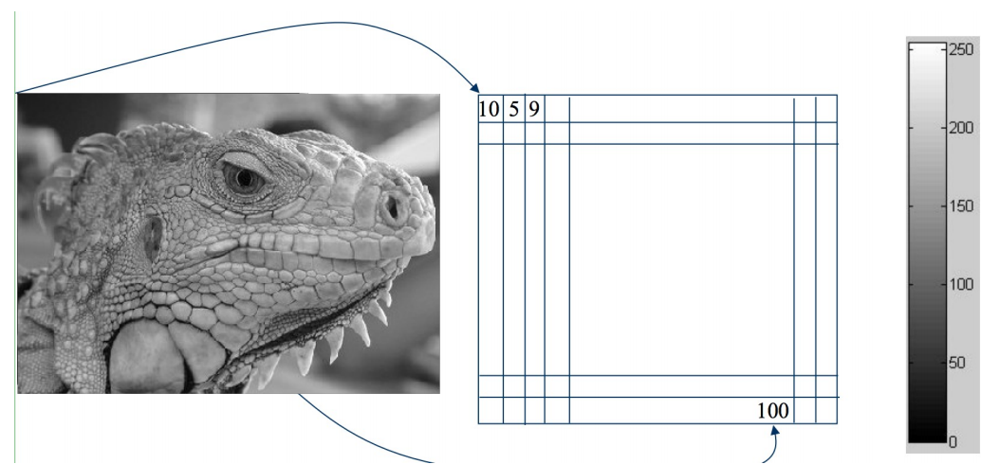

### Color image representation
A color image is stored as a 3D matrix of a stack of RGB channels. Each element is considered a pixel, and each pixel contains a stack of three channels that represents a mixture of red, green, and blue components.

A single channel is a 2D matrix where each element is considered a pixel, and each pixel can take on values from 0 (black) to 255 (the color of the channel). The value of each pixel represents how much the color of the channel contributes to the overall color of the pixel.

## Images are sampled and quantized ##
- Sampling Errors
    - Image is formed by sampling, making it an approximation
        - Can see distinct pixels if you zoom in on an image
        - Pixels with various grayscale values show texture
        - Much more difficult to represent curves, because pixels are not continuous

    - Improve accuracy by increasing number of pixels per unit, increasing resolution
    - Resolution
        - Sampling parameter
        - Dots per inch (DPI), pixel density
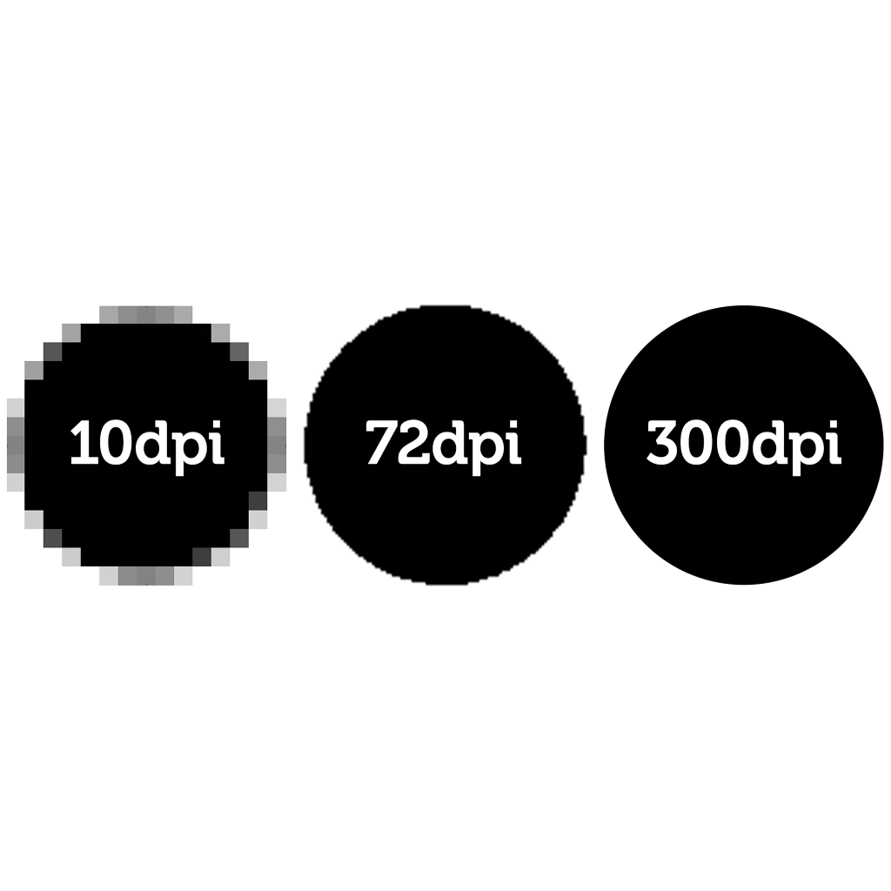
- Quantization	
    - Density values within the images are not continuous
    - Images contain a discrete number of pixels
        - Binary = [0, 1]
        - Grayscale = [0, 255]
        - Color: [R, G, B]
            - Where R/G/B = [0, 255]
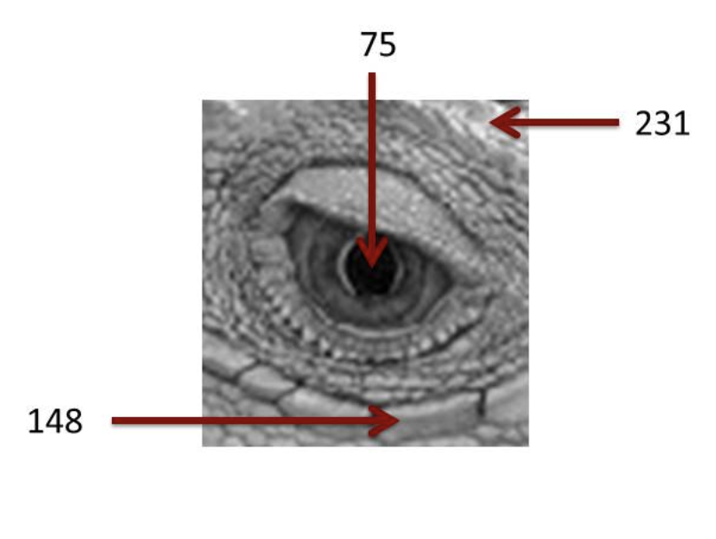
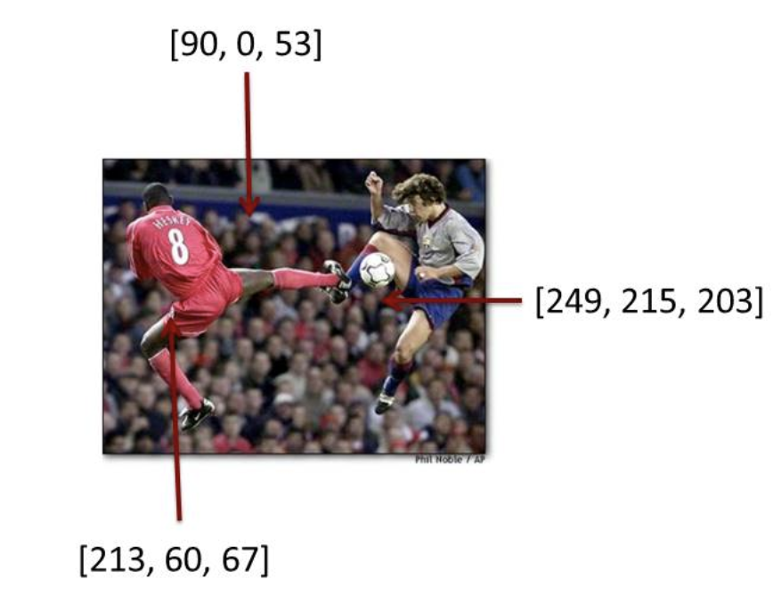

    - Information is lost and can’t be represented because of it
- Images are still useful even when they are approximations!

## Transformation Matrices
Matrices can be used to transform vectors by performing matrix multiplication. p’ = Ap

The simplest application is scaling a vector: 
# FIX PICTURE HERE! #

Matrices like **A** in the example above are known as transformation matrices. 

Multiple transformation matrices can be used to transform a point. For example, if we want to perform three transformations to a point: 
1. Scaling
2. Rotation A
3. Rotation B

Then we can write \\( p' = R_BR_ASp=R_B(R_A(Sp))) \\) 

The effect of this is to apply their transformations one after the other, from **right to left**. It is important to note that transformations are applied right to left. 

**Important:** The order of transformations can not be changed. Rotation followed by scaling is not the same as scaling followed by rotation. 

Equivalently, we can **first** multiply all the transformation matrices together to create a net change matrix:

\\[ Transform_{net} = (R_BR_AS) \\]

\\[ p' = (Transform_{net})p \\]

## Homogeneous Coordinates
Matrix multiplication allows us to make linear combinations of vector components ―
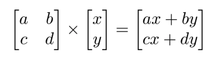
― and this is sufficient for the scaling, rotating, and skewing transformations that we have seen so far. However, this kind of multiplication between vector components does not allow us to add constants, which means that we cannot produce a translated vector such as <x+k, y+k>.

The way we get around this is by sticking a “1” at the end of every vector, and this is what is called **homogeneous coordinates**.
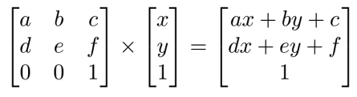

Note that compared with the first example, the dimensions of the matrix/vector being multiplied and of the resultant vector all increase by 1 each. The matrix’s rightmost column ― namely, <c, f, 1> ― is the vector that provides the constants to be added in the resultant vector. We can clearly see that such a constant vector can now be added as a translation (in *addition* to everything that was possible before ― scaling, rotating, and skewing).

Also, there is a particular reason that the homogeneous transformation matrix has [0, 0, 1] as its bottom row; we’d like the resultant vector to end up with a “1” at the bottom. This is a convention, and let’s dig deeper into a case in which this might be helpful.

### Division
There are times when we may want to divide the resultant vector by something. For example, we may want to divide by a coordinate to scale something down as it gets farther away in an image. However, there is no actual way to divide in matrix multiplication. 

This is where the convention of the homogeneous coordinates with “1” values come into play. Often, we will simply divide the result of the last coordinate after doing a matrix multiplication as we see below.
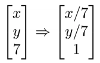

## Translation
**Goal:** given a coordinate p, produce a resultant coordinate p’ such that p’ is a translated version of p.
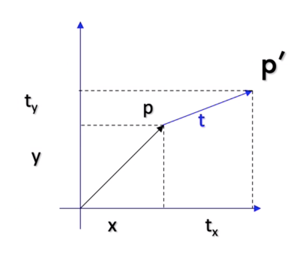
We can use a translation matrix as follows:
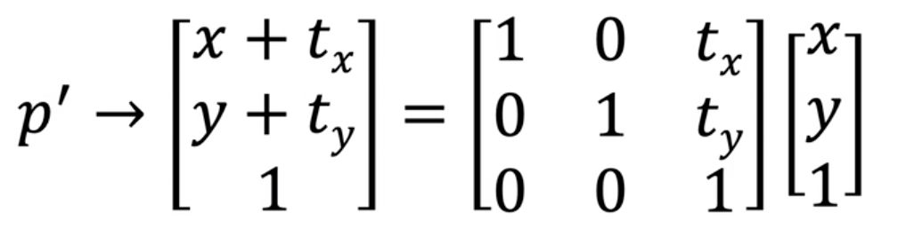

You may notice that the top left makes up an identity matrix and the top right represents the translation amount, as highlighted below. Therefore, we can rewrite the matrix as shown below. 
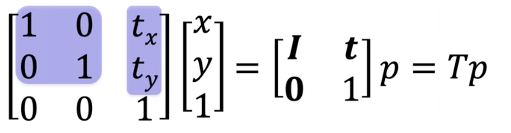

## Rotation
text

## Scaling
**Goal:** given a coordinate p, produce a resultant coordinate p’ such that p’ is a scaled version of p.
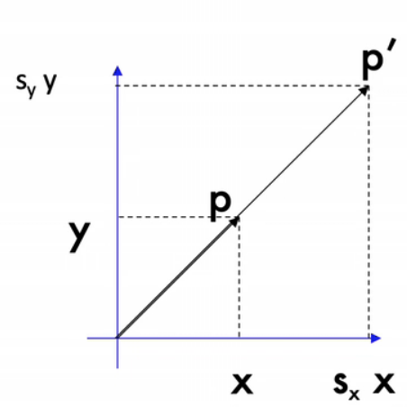
We can use a **scaling matrix** as follows:
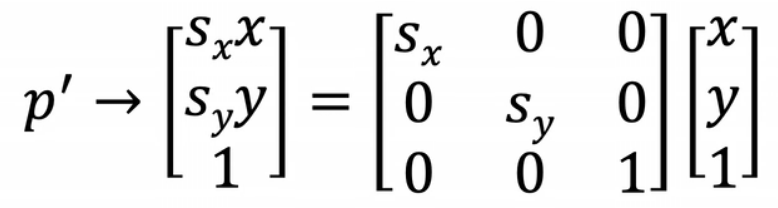

**Combine operations:**
We can combine scaling with other operations, such as translation:
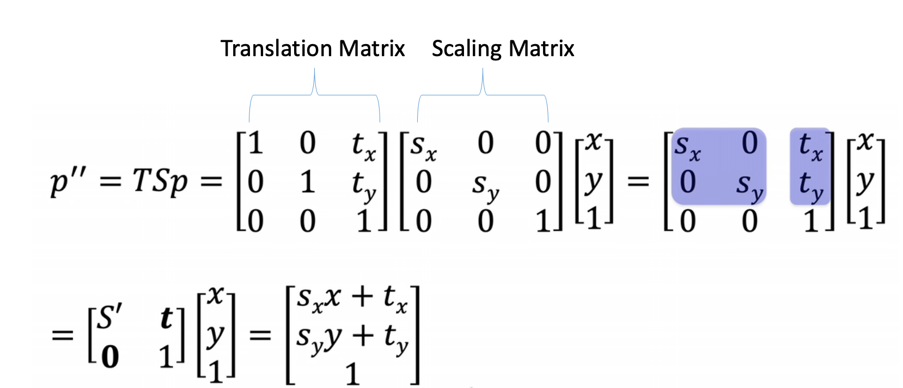

**Note:** order of operations matters: scaling + translation != translation + scaling. For example, if you first translate and then scale, then the difference from translation will be scaled up in the second operation.
