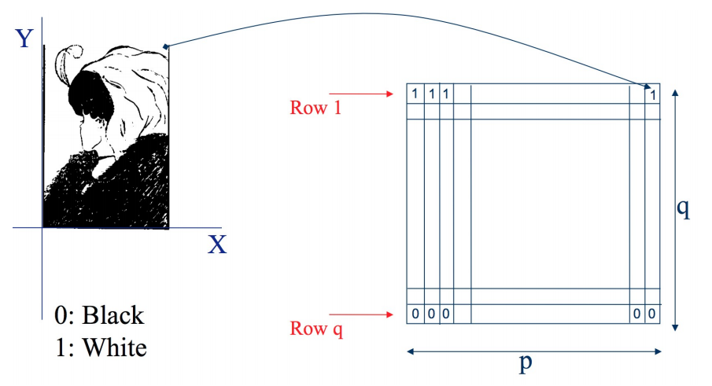
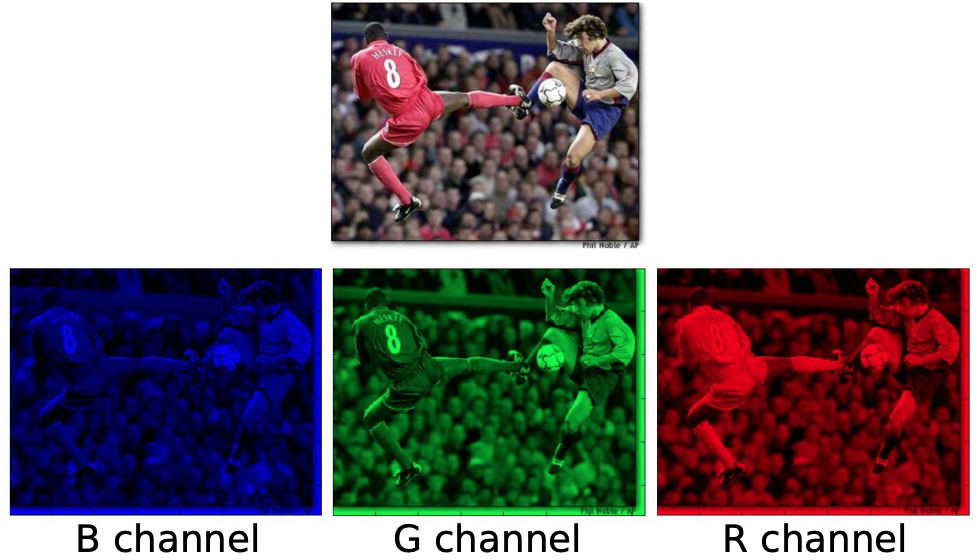
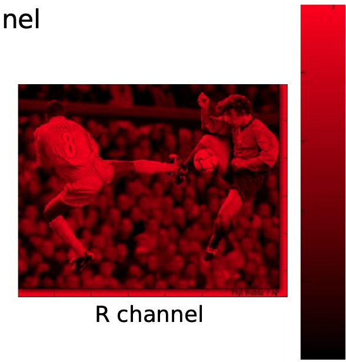
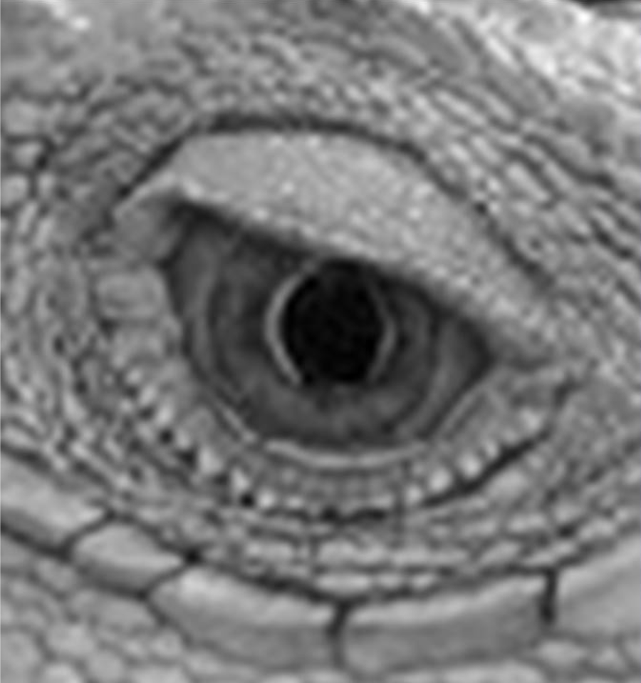
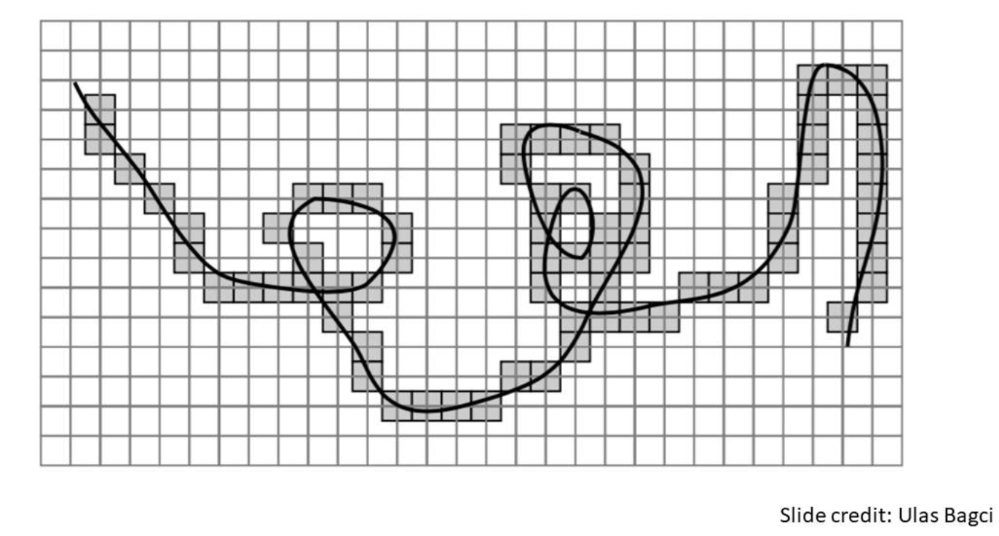

# Images and Transformations #

## Image Types ##
In computer vision, the three most common types of images are:
1. binary
2. grayscale
3. color

### Binary image representation ###
A binary image is stored as a 2D matrix of binary values. Each element is considered a pixel, and each pixel can only take two values: 0 (black) or 1 (white).

### Grayscale image representation ###
A grayscale image is stored as a 2D matrix of grayscale values. Each element is considered a pixel, and each pixel can take on values from 0 (black) to 255 (white), which represent the intensity or grayscale value.

### Color image representation ###
A color image is stored as a 3D matrix of a stack of RGB channels. Each element is considered a pixel, and each pixel contains a stack of three channels that represents a mixture of red, green, and blue components.

A single channel is a 2D matrix where each element is considered a pixel, and each pixel can take on values from 0 (black) to 255 (the color of the channel). The value of each pixel represents how much the color of the channel contributes to the overall color of the pixel.

## Images are sampled and quantized ##
- Sampling Errors
    - Image is formed by sampling, making it an approximation
        - Can see distinct pixels if you zoom in on an image
        - Pixels with various grayscale values show texture
        - Much more difficult to represent curves, because pixels are not continuous

    - Improve accuracy by increasing number of pixels per unit, increasing resolution
    - Resolution
        - Sampling parameter
        - Dots per inch (DPI), pixel density
